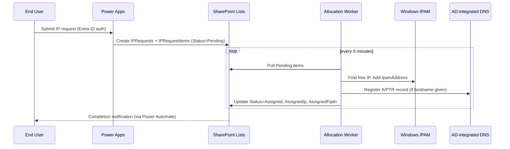
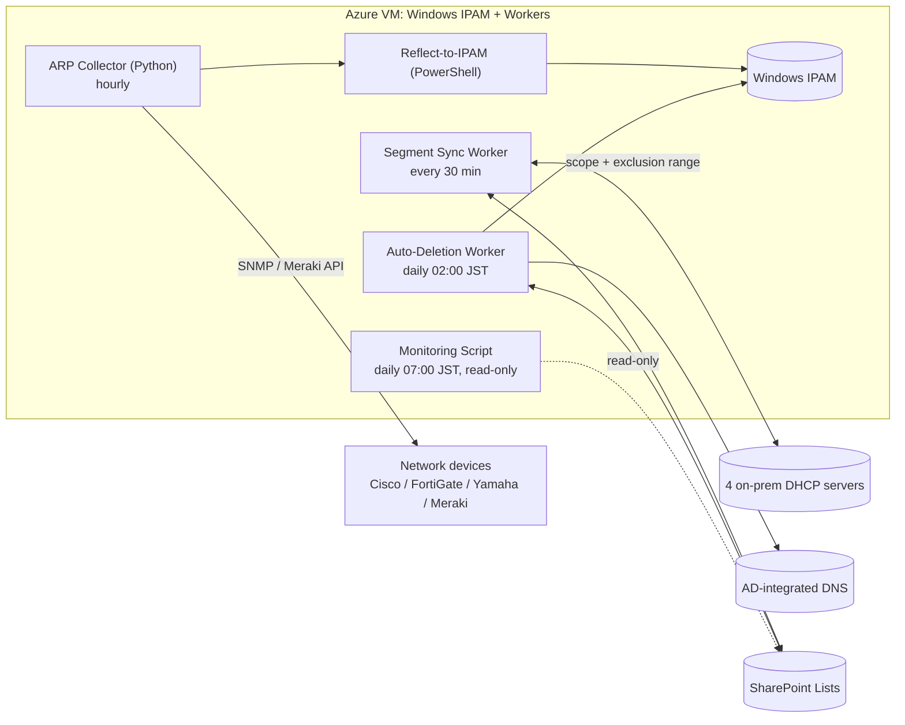

# Fixed IP Address Auto Allocation System

This repo implements the system designed in [`docs/design/Fixed IP Address Auto Allocation System Design v1.4.md`](docs/design/Fixed%20IP%20Address%20Auto%20Allocation%20System%20Design%20v1.4.md). End users request a fixed IP address through a Power Apps portal; a background worker allocates it in Windows IPAM and registers DNS, while a separate ARP-scanning worker continuously discovers manually-configured IPs across the network and reclaims addresses that are no longer in use.

This is **not** a conventional web app: the UI is a Power Apps canvas app, orchestration runs on Power Automate (Standard connectors only, per M365 E5 licensing), and the data store is 7 SharePoint lists. The actual business logic lives in 4 PowerShell/Python workers running on Task Scheduler on a single Azure VM that doubles as the Windows IPAM server. Everything else — 4 on-prem DHCP servers, AD-integrated DNS, multi-vendor network devices (Cisco/FortiGate/Yamaha/Meraki) — is existing infrastructure this project integrates with, not something it builds.

## Architecture

**IP registration flow** (user-driven, near real-time):



**Background workers** (scheduled, keep the system's ledger accurate over time):



## Directory structure

```
.
├── docker/                     Dockerfile + compose for the dev toolchain (NOT used for production)
├── docs/                       Design doc, operations runbook, open questions
├── infra/                      IaC (Bicep) + bootstrap script for the Azure VM
├── src/
│   ├── workers/                4 PowerShell workers + shared modules
│   ├── arp-collector/          ARP collection worker (Python) + IPAM reflection script (PowerShell)
│   └── config/                 External parameters (day thresholds, etc. — never hard-coded in workers)
├── powerplatform/              Power Apps canvas app + Power Automate flows (Power Platform Solution)
├── sharepoint/                 Schema + provisioning scripts for the 7 SharePoint lists
├── tools/                      Initial data-load scripts (Segments, ArpDeviceStatus)
└── tests/                      Pester (PowerShell) + pytest (Python)
```

Full explanation of every folder, coding conventions, rollout order, and how to run the test suite: see **[GUIDE.md](GUIDE.md)**.

## Environment Setup

### Requirements

| Component | Version | Used for |
|---|---|---|
| Windows PowerShell | 5.1 (IPAM module compatibility) | **Production workers only, on a real Windows Server** — cannot be containerized, see limitation below |
| Python | 3.11+ | ARP collection worker |
| Az CLI / Bicep | latest | Provisioning the Azure VM, Backup vault |
| PnP.PowerShell | latest | Provisioning the 7 SharePoint lists |
| Power Platform CLI (`pac`) | latest | Pack/unpack the Power Apps + Power Automate solution |
| Pester | 5.x | PowerShell unit tests |
| PSScriptAnalyzer | default ruleset | Mandatory lint |

### Docker dev-toolchain (recommended)

The fastest way to get a working environment that's identical on Mac and Windows — no need to install PowerShell/Python/Az CLI separately. `docker/Dockerfile` (built via `docker-compose.yml`, service `dev`) packages PowerShell 7, Pester, PSScriptAnalyzer, PnP.PowerShell, Python 3.12, Az CLI, and the `pac` CLI in a single image. This has been **verified to actually build and run** (build + lint + both test suites passing) on Apple Silicon (arm64) via OrbStack — not just written and assumed to work.

```bash
make build     # build the image (mcr.microsoft.com/dotnet/sdk:10.0 — the pac CLI package currently only ships for net10.0)
make lint-ps   # PSScriptAnalyzer, fails the build on any Severity=Error finding
make test-ps   # Invoke-Pester tests/powershell
make test-py   # pytest tests/python (uses its own venv inside the container, to avoid PEP 668 conflicts)
make test      # both of the above
make shell     # interactive shell — edit code on the host, run commands inside the container
```

Or drive Docker Compose directly, without the Makefile:

```bash
docker compose build
docker compose run --rm dev pwsh
docker compose run --rm dev pwsh -Command "Invoke-Pester ./tests/powershell -CI"
```

### Limitation: production workers cannot be containerized

This is architectural, not a tooling choice: `IpamServer` and most `DhcpServer`/`DnsServer` cmdlets (`Add-IpamAddress`, `Get-DhcpServerv4Scope`, ...) are Windows Server role features, not standalone-installable modules — they do not run in a container (Windows containers included). The Docker image here only covers linting/testing/writing the pure-logic parts of the code (it never calls real IPAM/DHCP/DNS); the 4 production workers still have to run on a real Windows Server, exactly as the design specifies.

### Native setup (without Docker)

Install each component from the requirements table directly, then run:

```powershell
Invoke-Pester ./tests/powershell -CI
```
```bash
pytest tests/python
```

Deployment order, coding conventions, and the full folder-by-folder breakdown: see [GUIDE.md](GUIDE.md).

## Infrastructure Deployment

Deploys the pieces defined in `infra/bicep/`: the Azure VM (Windows IPAM + Workers), its dedicated backup vault, and the VM heartbeat alert. This only provisions what the **vendor** is responsible for — the subscription, VNet, and subnet are the **client's** and must already exist.

### Prerequisites

- Azure CLI, logged in with Contributor (or equivalent) access to the target resource group (`az login`; use `az login --use-device-code` if running headless / inside the Docker dev container).
- A resource group to deploy into:
  ```bash
  az group create --name <target-rg> --location japaneast
  ```
- An existing VNet/subnet that can already reach the internal AD domain (VPN/ExpressRoute) — this is provided by the client, not created here.
- All commands below work identically whether run natively or inside the Docker dev-toolchain (`make shell` — Az CLI and Bicep are already installed there).

### 1. Look up the existing subnet's resource ID

```bash
az network vnet subnet show \
  --resource-group <client-network-rg> \
  --vnet-name <vnet-name> \
  --name <subnet-name> \
  --query id -o tsv
```

### 2. Validate before deploying (recommended)

```bash
az bicep build --file infra/bicep/main.bicep --stdout > /dev/null   # syntax check only

az deployment group what-if \
  --resource-group <target-rg> \
  --template-file infra/bicep/main.bicep \
  --parameters existingSubnetId=<subnet-id-from-step-1>
```

`what-if` prints exactly what would be created/changed without touching anything — review it before running the real deployment.

### 3. Deploy

```bash
az deployment group create \
  --name ipam-worker-infra \
  --resource-group <target-rg> \
  --template-file infra/bicep/main.bicep \
  --parameters existingSubnetId=<subnet-id-from-step-1>
```

`localAdminPassword` is `@secure()` and has no default, so Azure CLI will prompt for it interactively (input hidden) if you don't pass it. **Do not** pass it as `--parameters localAdminPassword=...` on the command line — it would land in shell history in plaintext.

**Parameters:**

| Parameter | Required | Default | Notes |
|---|---|---|---|
| `existingSubnetId` | Yes | — | resource ID from step 1 |
| `localAdminPassword` | Yes (prompted) | — | temporary only — replace with a gMSA/domain account right after the domain join |
| `vmName` | No | `vm-ipam-worker-01` | confirm against the client's naming convention before deploying |
| `vmTimeZone` | No | `Tokyo Standard Time` | the design requires JST |
| `location` | No | the resource group's location | |
| `actionGroupId` | No | `''` (no notification target) | resource ID of an Azure Monitor action group — see step 5.3 for how to create/find one |

### 4. Confirm it worked

```bash
az deployment group show --resource-group <target-rg> --name ipam-worker-infra \
  --query properties.provisioningState -o tsv
# expect: Succeeded

az resource show -g <target-rg> -n vm-ipam-worker-01 \
  --resource-type Microsoft.Compute/virtualMachines --query properties.provisioningState -o tsv
az resource show -g <target-rg> -n rsv-ipam-worker \
  --resource-type Microsoft.RecoveryServices/vaults --query properties.provisioningState -o tsv
az resource show -g <target-rg> -n alert-ipam-worker-vm-heartbeat \
  --resource-type Microsoft.Insights/metricAlerts --query properties.provisioningState -o tsv
# expect: Succeeded for all three
```

### 5. After deployment — manual steps not covered by Bicep

#### 5.1 Join the VM to the internal AD domain

Intentionally not automated by Bicep (see the `TODO` in `vm.bicep`). Assumes the client has already provided a domain-join-capable account and confirmed a target OU (see `docs/open-questions.md`).

RDP into the VM and run:

```powershell
# Run this ON the VM itself, over RDP, as a local administrator
Add-Computer -DomainName "<internal-ad-domain-fqdn>" `
  -OUPath "<ou-distinguished-name-if-any>" `
  -Credential (Get-Credential) `
  -Restart
```
`Get-Credential` prompts interactively — enter the domain-join account the client provided. The VM reboots to complete the join.

#### 5.2 Bootstrap the Worker environment

Run `infra/scripts/bootstrap-vm.ps1` on the VM, as Administrator, once it's domain-joined — installs the IPAM feature, the Python runtime, the `IPAM-Worker` event log, and registers the 5 Task Scheduler jobs.

#### 5.3 Wire up the heartbeat alert's notification target

`actionGroupId` is the resource ID of an Azure Monitor **action group** — a separate Azure resource that defines who/what actually gets notified when an alert fires (email, SMS, webhook, Logic App, ...). It's not created by this template; `main.bicep` defaults it to `''`, so **no one gets notified** until you point it at a real one.

Check with the client first — if their org already has a shared action group for IT/ops alerts, reuse its resource ID instead of creating a new one. Otherwise, create one:

```bash
az monitor action-group create \
  --resource-group <target-rg> \
  --name ag-ipam-worker-heartbeat \
  --short-name ipam-hb \
  --action email nkis-network nkis-network@nkc.co.jp

az monitor action-group show \
  --resource-group <target-rg> --name ag-ipam-worker-heartbeat \
  --query id -o tsv
```

Then pass that resource ID as the `actionGroupId` parameter, re-running the same deployment command from step 3 (it's idempotent — this just updates the alert resource, nothing else is recreated):

```bash
az deployment group create \
  --name ipam-worker-infra \
  --resource-group <target-rg> \
  --template-file infra/bicep/main.bicep \
  --parameters existingSubnetId=<subnet-id-from-step-1> \
  --parameters actionGroupId=<id-from-above>
```

## Related documentation

- Detailed development & deployment guide: [GUIDE.md](GUIDE.md)
- Full design document: `docs/design/`
- Operations runbook (a contractual deliverable — see design doc 10.5/10.6/10.7): `docs/runbook/`
- Open questions / pending values: `docs/open-questions.md`
